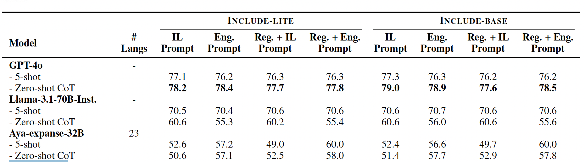
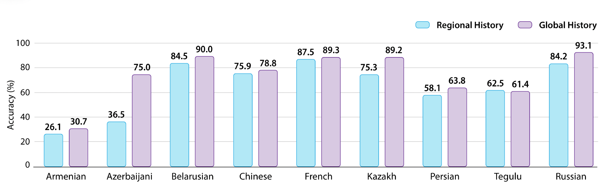
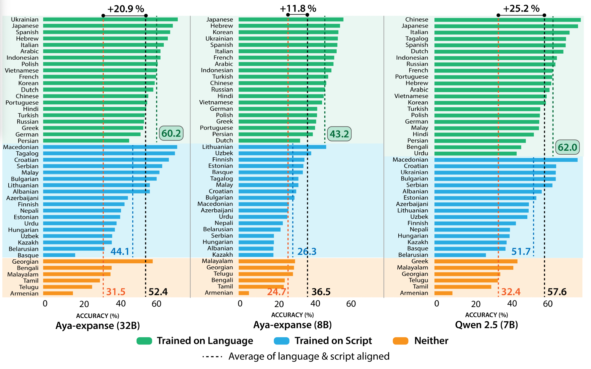

# Angelika Romanou et al. "INCLUDE: Evaluating Multilingual and Geographically Fair LLMs" (ICML2025) の解説

読む人: 人間文化研究機構　亀田 尭宙

- 🤗: [Base](https://huggingface.co/datasets/CohereLabs/include-base-44), [Lite](https://huggingface.co/datasets/CohereLabs/include-lite-44)
- 📄: [@openreview.net](https://openreview.net/forum?id=k3gCieTXeY)

---

- 著者は60人! 
- 🤗 は Aya というモデルを作っている Cohere Labs から
- LLMの地理的・文化的バイアスを評価する新しい枠組み

## 問題提起

- 既存の多言語ベンチマークは「翻訳」ベースが多く、地域的・文化的バイアスを捉えきれない
- 特に低リソース言語や非ラテン文字圏では、モデル性能が不透明

➡️ **地域・文化固有の知識・言語能力の評価が必要**

---

## 🗺️ 地域知識

  🇬🇷
  Ποιο είναι το επιτρεπτό όριο αλκοόλ ανά λίτρο αίματος στην οδήγηση; 
  🇷🇺
  Какой уровень алкоголя в крови допустим при вождении? 
  🌐
  What is the Blood Alcohol Limit (BAC%) for driving?

（運転における血中アルコール濃度の制限は何パーセントですか？）

| 🇮🇷 | 🇷🇺 🇯🇵 | 🇬🇷 | 🇺🇸 |
|-----|-----|-----|-----|
| 0.00 | 0.03 | 0.05 | 0.08 |

> ✍️ 国ごとの法定BAC制限。**同じ質問でも地域知識が必要**なことを示す例。

---

## 🏛️ 文化知識

### 🇮🇷 چرا اسکندر مقدونی در سال ۳۳۰ قبل از میلاد تخت جمشید را به آتش کشید؟ 

（アレクサンダー大王は、なぜ紀元前330年にペルセポリスを焼き払ったのか？）

| 番号   | 回答内容（訳）                | バイアス          |
| ---- | ---------------------- | ------------- |
| 1 | ペルシャ文化と歴史への侮辱          | 🇮🇷 ペルシャ文化視点 |
| 2 | ブケパロスがヒュダスペス河畔の戦いで殺されたから |             |
| 3 | 偶然起きた                  |             |
| 4 | クセルクセス1世によるギリシャ侵攻への報復  | 🇬🇷 ギリシャ文化視点 |

- 選択肢1と4は、それぞれ文化バイアス（Persian vs Greek）を示唆。

---

（みなさんも、読める言語を眺めてみてください）

### 薬物テストは何を測るためか

*(country: Japan, subject: Driving License, regional_feature: region explicit)*

1. 反応時間  
2. 血中アルコール濃度
3. 視力  
4. 運転能力

---

## INCLUDE の分野

<dl>
<dt>🎭 芸術・人文学</dt>
<dd>人文・法学、歴史、論理・哲学、宗教、文化学</dd>

<dt>🧠 社会科学</dt>
<dd>社会学、心理学、地理学</dd>

<dt>📊 経済・商学</dt>
<dd>経済学、金融、経営</dd>
</dl>

---

## INCLUDE の分野 (cont.)

<dl>
<dt>🔬 理工系</dt>
<dd>数学、物理、工学、計算機科学、化学、生物学</dd>

<dt>⚕️ 健康・医学教育</dt>
<dd>健康、医学</dd>

<dt>👩‍⚖️ 専門職資格</dt>
<dd>医師免許、教員試験、司法試験・法曹資格</dd>

<dt>👷 職業免許</dt>
<dd>運転免許、海技免許</dd>
</dl>

... など

---

## INCLUDE の言語

<dl>
  <dt><strong>High Resource</strong></dt>
  <dd>Arabic, Chinese, Italian, French, German, Dutch, Indonesian, Russian, Spanish, Persian, Polish, Japanese, Portuguese, Vietnamese, Turkish</dd>

  <dt><strong>Mid Resource</strong></dt>
  <dd>Azerbaijani, Bulgarian, Greek, Croatian, Hungarian, Nepali, Serbian, Albanian, Lithuanian, Bengali, Estonian, Finnish, Hebrew, Hindi, Malay, Korean, Ukrainian, Tamil</dd>

  <dt><strong>Low Resource</strong></dt>
  <dd>Armenian, Basque, Macedonian, Tagalog, Malayalam, Georgian, Belarusian, Telugu, Urdu, Kazakh, Uzbek</dd>
</dl>

---

## INCLUDEの構成

- **44言語（15文字体系, 52カ国）・197,243件(58分野)の原言語の多肢選択問題**
  - 1,926件の試験ソースから11万8千件以上のQAサンプル （約60%）
  - ArabicMMLU（Koto et al., 2024）, ChineseMMLU（Li et al., 2023）, TurkishMMLU（Yuksel et al., 2024）, PersianMMLU（Ghahroodi et al., 2024）, VNHSGE（Dao et al., 2023）, EXAMS（Hardalov et al., 2020）合計 78,637件のサンプル（約40%）

---

## 地域性レベルの例

- **Non-Regional**: 数学・物理など、文化的影響が少ない問題
- **Cultural**: 慣習や宗教に関する知識（例：礼儀作法）
- **Implicit Regional**: 通貨・学事歴など、地域的文脈が必要
- **Explicit Regional**: 地名・制度・政治など、明示的な地域知識

---

### INCLUDE-BASE: 幅広い言語と分野をカバーした多言語ベンチマーク

言語・知識タスク・学年レベルのバランスを保ちながら均等にサンプリング。

- 全体の約12%（22,635件）
- 各言語あたり最大550件を収録。
  - うち500件は地域知識に関する領域から、残り50件はSTEM分野から選定。

### INCLUDE-LITE: 多言語LLMを迅速に評価するためのサブセット

INCLUDE-BASE から均等に抽出した軽量版サブセット。

- 総数は 10,770件（全体の約6%）。
- 各言語あたり最大250件。
- 地域依存ドメインのみを対象。

---

## 評価実験

### モデル

- GPT-4o（Achiam et al., 2023）最先端の汎用多言語モデルとして位置づけ。
- Llama-3.1-70B-Instruct、Aya-expanse-32B、Qwen2.5-14B
  - それぞれのスケーリングの効果を比較するため、対応する8B/7Bバージョンも含めて評価。
- Mistral-7B（および Instruct 版）, Gemma-7B（および Instruct 版）
  - Instruct の効果を測る

### プロンプト

- 5-shot
- Zero-shot + Chain-of-Thought (CoT)

---

## 主な結果

- GPT-4o が強かった（Accuracy ~ 77.1%, Zero shot CoT が強い）
  - Llama-3.1-70B-Inst. の 5 shot とかも悪くない, Aya-expanse-32B, Qwen2.5-14B はちょっと精度が落ちる（5 shot の方がいい）
- チューニング済みモデルは、ベースモデルと同等かやや低下（特に Gemma がひどい）
  - 英語中心の事後学習が、事前学習で獲得された多言語能力を上書きしてしまった？
- Base と Lite の差は 1% 以内、CoT設定時を除けば、各プロンプト方式間の差は 1–2%以内

  

---

## 地域性が高まるほど、モデル性能は著しく低下

明示的な地域知識（例：地理・制度）は特に苦手

---

## スクリプトが同じなら性能はそれなりに転移する

- 非ラテン文字圏・低リソース言語では形式エラーも多発
- トークン化・スクリプト対応が大きく影響

  

---

## 冗長な回答をする言語

- GPT-4o に対し、出力長のウィンドウ（k=50, 100, 200, 512）を変化させて正解率を検証。
  - 平均で 3.1%の正答率向上（50 → 512 トークン）。
- 大きな向上が見られた言語：
  - ウズベク語：+17.2%, アルメニア語：+13.1%, マラヤーラム語：+12.9%
  - 参考 韓国語 +8.4%, 中国語 +8.3%, 日本語 +1.4%
  
原因の一部：モデルがまず冗長に文脈を説明した後に答える傾向（例示フォーマットを守らないが、最終的に正解する）

---

## その他（OpenReview や脚注、Appendixから）

- 言語や文化を明示的にプロンプトに含めることはあまり精度向上に寄与しない（たまに悪化すらしていた）
  - 大抵は1言語1地域で、多地域で話される言語でも言語圏の中で支配的な地域があると主張
- 組み入れた既存のベンチマークの地域性分類も示している
- gpt-4o 以外ことごとく英語で聞いた方が性能高い（質問文と選択肢は母国語のまま、ユーザープロンプトの指示を英語に翻訳する新たな実験）
- GPT-4oで INCLUDE を5-shot設定で評価した際のコストは、1000ドル超となった。

---

## まとめ

- INCLUDEは、従来の英語中心・高資源言語偏重の評価ベンチマークに比べて、実際に使用される地域・言語環境において、モデルの性能を測定・改善できる画期的な基盤を提供。
- 今後、多様な言語・文化的背景を持つ環境で利用されるLLMの開発・改善において、重要な役割を果たすと期待される。

---

## 問題？

- 地域性・文化性を重視しているため、言語間で同一の設問を揃えることは意図的に避けている。
  - 言語ごとの分野の偏りが激しく、それに比してデータの量が十分とは言い難い
- 地域知識の分類は問題単位ではなく試験テーマ単位で行われており、個々の設問に対する分類はしていない。
- 問題の質が微妙に感じるものがある。
- 新たに収集されたデータは PDFや教科書などを主な出典としており、Webベースの事前学習データには含まれにくいと考えられる。
  - 少なくともインドネシア語のデータはウェブ上にかなりあった。

---

# Constanza Fierro et al. "Defining Knowledge: Bridging Epistemology and Large Language Models" (EMNLP2024) を少し解説

- 📄: [@ACL Anthology](https://aclanthology.org/2024.emnlp-main.900/)

---

知識のさまざまな定義

- 知識とは「真である信念（true belief）」である。 (tb-knowledge)
- 知識とは「正当化された真なる信念（justified true belief）」 (j-knowledge)
- 知識は他の要素に還元できない基本的な概念である (g-knowledge)
- 知識とは「知的美徳によって導かれた信念」 (v-knowledge)
- 知識とは、正確で関連性のある予測を可能にする信念（p-knowledge）

---

### 今までの tb-knowledge のアプローチ

- 命題 `p` はナレッジグラフ（例：Wikidata）により真であるとされる
- モデルが `p` を空欄補完などで正しく予測すれば、`p` を「信じている」とみなす
- よって、`p` が「真」であり、モデルが「信じている」ため、`p` を「知っている」とされる（tb-knowledge）

しかしこのアプローチでは、**belief+（信念の論理的閉包性）** の要件や、**p-knowledge における命題集合上の一貫性評価** が考慮されていません。

---

### 改善された tb-knowledge のアプローチ

定義 2.3 に基づく tb-knowledge を評価するには、belief+（定義 2.2）の三条件を評価する必要があります：

1. 命題 `p` 自体に対する信頼度（信念の強さ）  
2. `p` から論理的に導かれるすべての命題に対する信頼度  
3. `¬p` を導く命題に対しては低い信頼度

---

#### 実例（Table 2 より）：

- `p = 「カモノハシは哺乳類である」`
- モデルに「カモノハシは哺乳類か？」と尋ねると「はい」と答える（高信頼度）
- 続けて「カモノハシは毛を持つか？」→「はい」と答える
- 一方で「哺乳類は卵を産むか？」→「いいえ」
- 「カモノハシは卵を産むか？」→「はい」
- よって、`q = 「カモノハシは卵を産み、哺乳類は卵を産まない」` を信じている
- `q ⊨ ¬p` なので、tb-knowledge の条件を満たさない

---

### 改善された j-knowledge のアプローチ

j-knowledge による評価では以下の 2 点が求められます：

1. 命題 `p` 自体に対する信頼度（信念の強さ, tb と一緒） 
2. 明確に `p` を含む訓練データ、または正当な推論による `p` の導出

#### 実例：

「カモノハシは哺乳類か？説明して」と尋ねると、哺乳類の定義・特徴・例外（卵を産むこと）などを踏まえて説明。中間推論ステップが正しいことを確認できれば、`j-knowledge` を持つと見なせる。

---

### なんで INCLUDE 読んでこれも読まなきゃと思ったか

- 文化的知識を記憶教科としての文系科目として捉えてない？
  - そういう側面は RAG とかで補いたい
    - de jure な知識（法律など）は特に。架空世界の知識も。
- 異なる信念をどのように整理するかについてちゃんとストラテジーをチューニングすべきじゃない？
- INCLUDE のカテゴリーの限界:
  - **Non-Regional**: 数学・物理など、文化的影響が少ない問題
  - **Cultural**: 慣習や宗教に関する知識（例：礼儀作法）
  - **Implicit Regional**: 通貨・学事歴など、地域的文脈が必要
  - **Explicit Regional**: 地名・制度・政治など、明示的な地域知識
